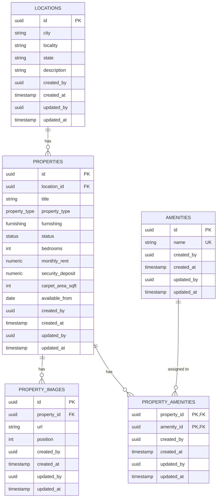

## DB Design

### Adding Property listings

```mermaid
erDiagram

    LOCATIONS {
        uuid id PK
        string city
        string locality
        string state
        string description
        uuid created_by
        timestamp created_at
        uuid updated_by
        timestamp updated_at
    }

    PROPERTIES {
        uuid id PK
        uuid location_id FK
        string title
        property_type property_type
        furnishing furnishing
        status status
        int bedrooms
        numeric monthly_rent
        numeric security_deposit
        int carpet_area_sqft
        date available_from
        uuid created_by
        timestamp created_at
        uuid updated_by
        timestamp updated_at
    }

    PROPERTY_IMAGES {
        uuid id PK
        uuid property_id FK
        string url
        int position
        uuid created_by
        timestamp created_at
        uuid updated_by
        timestamp updated_at
    }

    PROPERTY_AMENITIES {
        uuid property_id PK, FK
        uuid amenity_id PK, FK
        uuid created_by
        timestamp created_at
        uuid updated_by
        timestamp updated_at
    }

    AMENITIES {
        uuid id PK
        string name UK
        uuid created_by
        timestamp created_at
        uuid updated_by
        timestamp updated_at
    }

    LOCATIONS ||--o{ PROPERTIES : "has"
    PROPERTIES ||--o{ PROPERTY_IMAGES : "has"
    PROPERTIES ||--o{ PROPERTY_AMENITIES : "has"
    AMENITIES ||--o{ PROPERTY_AMENITIES : "assigned to"
```