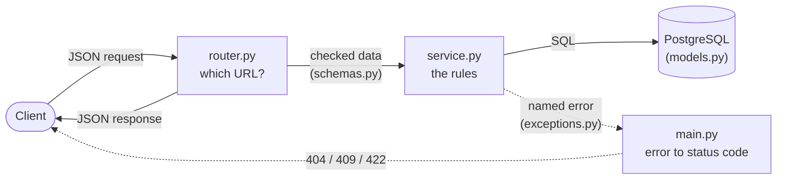

# From ER diagram to working API

This guide explains, in plain words, how the design in
[er-diagram.md](er-diagram.md) became real database tables, Python code and HTTP
endpoints. Read it top to bottom: each section answers one question.

The requests and responses shown here come from a real run against PostgreSQL.
IDs are shortened (`d888e43a-…`) so the examples are easier to read.

> Want to add a brand-new feature yourself? That step-by-step recipe is in
> [adding-a-feature.md](adding-a-feature.md). This guide explains what was built
> and why.

---

## 1. What we built, in one minute

- **5 tables** from the ER diagram: `locations`, `amenities`, `properties`,
  `property_images` and `property_amenities`.
- **3 feature folders** in `src/rentals_api/`: `locations/`, `amenities/` and
  `properties/`.
- **1 migration**, the script that creates the five tables in PostgreSQL.
- **An API** under `/api/v1` to create, read, update, delete and search.
- **Tests** for every endpoint, run against a real database.

---

## 2. Where the code lives

```
src/rentals_api/
  locations/        NEW  the "locations" table
  amenities/        NEW  the "amenities" table (the catalogue: Parking, Gym, ...)
  properties/       NEW  "properties" + "property_images" + "property_amenities"
  db/mixins.py      NEW  the 4 audit columns every table shares
  db/base.py        changed: lists the new models so Alembic can see them
  api/deps.py       changed: adds ActorId (who is calling) and pagination limits
  api/router.py     changed: mounts the 3 new routers
  main.py           changed: one table that maps errors to HTTP status codes
alembic/versions/
  ..._add_rentals_schema.py   NEW  the migration
tests/
  locations/  amenities/  properties/   NEW  tests, mirroring the code folders
```

Every feature folder has the **same five files**, copied from the `items/` example:

| File | Its one job |
| --- | --- |
| `models.py` | The shape of the table: columns, types, keys |
| `schemas.py` | The shape of the JSON: what a client may send and what it gets back |
| `service.py` | The rules: checks, saving, and turning database errors into named errors |
| `router.py` | The URLs: which path and method calls which service function |
| `exceptions.py` | Named errors such as `LocationInUseError` |

### Why 3 folders for 5 tables?

A folder is for a **feature**, not for a table. Ask one question: *would anyone
create, list or delete this thing on its own?*

| Table | Its own folder? | Why |
| --- | --- | --- |
| `locations` | Yes | You create a location before any property exists |
| `amenities` | Yes | It is a shared catalogue (WiFi, Gym, ...) |
| `properties` | Yes | The main thing we list |
| `property_images` | No, lives in `properties/` | An image only exists as part of a property |
| `property_amenities` | No, lives in `properties/` | A link table; it means nothing without its property |

### Why not a `models/` folder and a `schemas/` folder?

That layout is common and not wrong. This project keeps each feature together
instead, because:

- **One change, one folder.** Adding a column to properties touches files that
  sit side by side in `properties/`, not files spread across four folders.
- **You can see who depends on whom.** `properties/models.py` imports from
  `locations` and `amenities`; nothing imports from `properties`.
- **Deleting a feature means deleting one folder.**
- **The tooling expects it.** The lint rule that stops `service.py` from
  importing FastAPI is set up for this layout.

If you want a list of all models in one place, [db/base.py](../src/rentals_api/db/base.py)
already is that list.

---

## 3. The journey of one request



Take `POST /api/v1/amenities` with `{"name": "Gym"}`:

1. **FastAPI checks the JSON** against `AmenityCreate` in `schemas.py`. An empty
   name is rejected with a 422 before any of our code runs.
2. **The router** passes the checked data to the service. That's all it does:

   ```python
   # amenities/router.py
   @router.post("", response_model=AmenityRead, status_code=status.HTTP_201_CREATED)
   async def create_amenity(payload: AmenityCreate, db: DbSession, actor_id: ActorId) -> Amenity:
       return await service.create_amenity(db, payload, actor_id=actor_id)
   ```

3. **The service** saves the row. If the name already exists, it raises a
   named error. It never mentions HTTP or status codes:

   ```python
   # amenities/service.py (type hints trimmed)
   async def create_amenity(db, data, *, actor_id):
       amenity = Amenity(**data.model_dump(), created_by=actor_id, updated_by=actor_id)
       db.add(amenity)
       await _commit_or_translate(db, name=data.name)  # duplicate -> DuplicateAmenityNameError
       await db.refresh(amenity)
       return amenity
   ```

4. **`main.py`** turns named errors into status codes, all in one table:

   ```python
   DOMAIN_ERROR_STATUS: dict[type[Exception], int] = {
       ...
       DuplicateAmenityNameError: status.HTTP_409_CONFLICT,
       ...
   }
   ```

Why split it like this? The service can be tested without a web server, and
there is exactly one place to look to find which error gives which status code.

---

## 4. The tables

### 4.1 Four columns every table shares

The ER diagram gives every table `created_by`, `created_at`, `updated_by` and
`updated_at`. Instead of typing them five times, we wrote them once in
[db/mixins.py](../src/rentals_api/db/mixins.py) and each model "mixes them in":

```python
class Location(AuditMixin, Base):  # AuditMixin adds the four audit columns
    __tablename__ = "locations"
    ...
```

| Column | Filled by |
| --- | --- |
| `created_at` / `updated_at` | The database clock. `updated_at` moves forward on every update made through the app |
| `created_by` / `updated_by` | The `X-User-Id` header of the request (see below) |

> **Placeholder warning.** There is no login yet, so "who did this" comes from a
> header the client sends: `X-User-Id: <uuid>`. Anyone can fake it. When real
> authentication is added, only `get_actor_id()` in
> [api/deps.py](../src/rentals_api/api/deps.py) has to change. If the header is
> missing, the columns are left empty (`null`).

### 4.2 Fixed lists of choices (enums)

Some columns only accept a fixed list of values. PostgreSQL stores these as
**enum types**:

| Column | Allowed values |
| --- | --- |
| `property_type` | `apartment`, `independent_house`, `villa`, `studio` |
| `furnishing` | `unfurnished`, `semi_furnished`, `fully_furnished` |
| `status` | `available` (the default), `rented`, `inactive` |

Two small decisions:

- The diagram calls the status type `status`. We named it `property_status` so
  a future "booking status" can't clash with it.
- All three enums are built by one helper, `_pg_enum()`. It makes the database
  store the **value** (`semi_furnished`), not the Python name
  (`SEMI_FURNISHED`). It's easy to forget that setting on one enum, so the
  helper does it for all three.

> These values are a first guess. Adding a value later is easy, but PostgreSQL
> cannot *remove* one, so change them now if they are wrong.

### 4.3 How the tables are linked, and what happens on delete

The lines in the ER diagram are **foreign keys**: a column that points at a row
in another table. Each one also says what happens when that row is deleted:

| You delete... | What happens | Rule in the database |
| --- | --- | --- |
| a **property** | its images and amenity links are deleted too | `ON DELETE CASCADE` (they belong to it) |
| a **location** that still has properties | refused with **409** | `ON DELETE RESTRICT` (it would leave properties pointing at nothing) |
| an **amenity** still given to a property | refused with **409** | `ON DELETE RESTRICT` |
| an **image** | just that image | none needed |

How does the service know *which* rule was broken? Every constraint has a fixed
name, from the naming convention in `db/base_class.py`. The service looks for
that name in the error:

```python
# locations/service.py
PROPERTIES_FK = "fk_properties_location_id_locations"
...
    except IntegrityError as exc:
        await db.rollback()  # required after any database error
        if PROPERTIES_FK in str(exc.orig):
            raise LocationInUseError(location_id) from exc
        raise
```

### 4.4 Extra safety rules (not in the diagram)

These rules sit in the database itself, so even code that skips the API can't
store bad data:

- **Checks:** `bedrooms >= 0`, `monthly_rent >= 0`, `security_deposit >= 0`,
  `carpet_area_sqft > 0` and image `position >= 0`.
- **Unique:** two amenities can't have the same `name`.
- **Indexes** on `properties.location_id`, `property_images.property_id` and
  `property_amenities.amenity_id`. PostgreSQL does not index foreign keys on
  its own, and these keep lookups and deletes fast.
- **Optional columns:** apart from the audit `*_by` columns, only
  `locations.description` and `properties.carpet_area_sqft` may be empty.
  Everything else is required.

### 4.5 Money

`monthly_rent` and `security_deposit` are `NUMERIC(12, 2)`: exact decimals, up to
two digits after the point. You can send `25000`, `25000.5` or `"25000.50"`, and
the API always answers with a **string** such as `"25000.00"`. A string keeps
the exact amount; floats can round it.

---

## 5. The migration

A **migration** is a script that moves the database from one version to the
next. Ours creates the five tables:
[alembic/versions/…_add_rentals_schema.py](../alembic/versions/20260912_1107-7bc2c739d594_add_rentals_schema.py).

**How we made it**

```
uv run poe migrate                          # bring the database up to date first
uv run poe revision -m "add rentals schema" # Alembic compares models to the DB and writes the script
uv run poe fmt                              # format the generated file
```

**The one manual fix.** Alembic writes a `downgrade()` (the "undo") that drops
the tables but **forgets the three enum types**. Undoing and then redoing the
migration would then fail with `type "property_type" already exists`. So we
added:

```python
bind = op.get_bind()
for enum_name in ("property_status", "furnishing", "property_type"):
    sa.Enum(name=enum_name).drop(bind, checkfirst=False)
```

**How we checked it**

| Check | Command | Expected |
| --- | --- | --- |
| It applies | `uv run poe migrate` | runs without errors |
| Nothing is missing | `uv run poe revision -m "recheck"` | **no new file** (models and database agree) |
| It can be undone | `uv run poe downgrade`, then `uv run poe migrate` | both run cleanly |

---

## 6. Using the API

The easiest way to try it is to run `uv run poe dev`, open
<http://127.0.0.1:8000/docs>, and use **Try it out** on each endpoint.

### 6.1 All endpoints

Everything is under `/api/v1`.

| Method | Path | What it does |
| --- | --- | --- |
| `GET` `POST` | `/locations` | List / create locations |
| `GET` `PATCH` `DELETE` | `/locations/{id}` | Read / change / delete one |
| `GET` `POST` | `/amenities` | List / create amenities |
| `GET` `PATCH` `DELETE` | `/amenities/{id}` | Read / rename / delete one |
| `GET` | `/properties` | Search properties (filters below) |
| `POST` | `/properties` | Create a property, optionally with amenities |
| `GET` `PATCH` `DELETE` | `/properties/{id}` | Read / change / delete one |
| `PUT` | `/properties/{id}/amenities` | Replace the property's amenity list |
| `POST` | `/properties/{id}/images` | Add an image |
| `PATCH` `DELETE` | `/properties/{id}/images/{image_id}` | Change / delete one image |

Lists return 50 items by default. Use `limit` (1-100) and `offset` to page
through them.

### 6.2 A walk through a typical flow

**1. Create a location.** The `X-User-Id` header records who did it.

```http
POST /api/v1/locations
X-User-Id: 3f2a9c1e-5b7d-4e8a-9c6f-1a2b3c4d5e6f

{"city": "Hyderabad", "locality": "Madhapur", "state": "Telangana", "description": "IT corridor"}
```

`201 Created`:

```json
{
  "id": "d888e43a-…",
  "city": "Hyderabad",
  "locality": "Madhapur",
  "state": "Telangana",
  "description": "IT corridor",
  "created_by": "3f2a9c1e-…",
  "created_at": "2026-09-12T05:47:03.877255Z",
  "updated_by": "3f2a9c1e-…",
  "updated_at": "2026-09-12T05:47:03.877255Z"
}
```

**2. Create amenities**, one request each: `{"name": "Parking"}`, `{"name": "Gym"}`,
`{"name": "WiFi"}`.

**3. Create a property**, attaching two of the amenities by ID:

```json
{
  "location_id": "d888e43a-…",
  "title": "2BHK near Madhapur metro",
  "property_type": "apartment",
  "furnishing": "semi_furnished",
  "bedrooms": 2,
  "monthly_rent": 25000,
  "security_deposit": 50000,
  "carpet_area_sqft": 1100,
  "available_from": "2026-10-01",
  "amenity_ids": ["04b37a79-…", "068461d5-…"]
}
```

The `201 Created` response **includes** the location, images and amenities, so
one request gives you everything to show a listing:

```jsonc
{
  "id": "09422814-…",
  "title": "2BHK near Madhapur metro",
  "property_type": "apartment",
  "furnishing": "semi_furnished",
  "status": "available",            // not sent, so the default was used
  "bedrooms": 2,
  "monthly_rent": "25000.00",       // money comes back as a string
  "security_deposit": "50000.00",
  "carpet_area_sqft": 1100,
  "available_from": "2026-10-01",
  "location": {"id": "d888e43a-…", "city": "Hyderabad", "locality": "Madhapur", "state": "Telangana"},
  "images": [],
  "amenities": [                    // always sorted by name
    {"id": "068461d5-…", "name": "Gym"},
    {"id": "04b37a79-…", "name": "Parking"}
  ],
  "created_by": "3f2a9c1e-…",
  // ... created_at, updated_by, updated_at
}
```

**4. Add an image.** `position` sets the order; `0` comes first and is the default.

```http
POST /api/v1/properties/09422814-…/images

{"url": "https://img.example.com/madhapur-2bhk/living-room.jpg", "position": 0}
```

```json
{"id": "76b239c7-…", "url": "https://img.example.com/madhapur-2bhk/living-room.jpg", "position": 0}
```

**5. Change the amenities.** `PUT` sends the **complete new list**. Here Gym is
removed and WiFi is added:

```http
PUT /api/v1/properties/09422814-…/amenities
X-User-Id: 8c4e2b1a-7f6d-4c3b-a2e1-9f8e7d6c5b4a

{"amenity_ids": ["04b37a79-…", "d3ccbfc2-…"]}
```

```json
[{"id": "04b37a79-…", "name": "Parking"}, {"id": "d3ccbfc2-…", "name": "WiFi"}]
```

**6. Update the property.** `PATCH` changes only the fields you send:

```http
PATCH /api/v1/properties/09422814-…
X-User-Id: 8c4e2b1a-7f6d-4c3b-a2e1-9f8e7d6c5b4a

{"monthly_rent": "27000", "status": "rented"}
```

```jsonc
{
  "status": "rented",
  "monthly_rent": "27000.00",
  "title": "2BHK near Madhapur metro",   // untouched
  "created_by": "3f2a9c1e-…",            // still the first user
  "updated_by": "8c4e2b1a-…"             // now the second user
  // ... everything else unchanged
}
```

**7. Search.**

```http
GET /api/v1/properties?city=hyderabad&max_rent=30000
```

This returns a list of properties in the same shape as step 3. Available filters:

| Filter | Example | Meaning |
| --- | --- | --- |
| `city` | `city=hyderabad` | Exact city name, upper/lower case ignored (`hyder` won't match) |
| `location_id` | `location_id=d888e43a-…` | One specific location |
| `property_type` | `property_type=villa` | One of the enum values |
| `furnishing` | `furnishing=fully_furnished` | One of the enum values |
| `status` | `status=available` | One of the enum values |
| `min_bedrooms` | `min_bedrooms=3` | At least this many bedrooms |
| `min_rent`, `max_rent` | `max_rent=30000` | Rent between these amounts, inclusive |
| `limit`, `offset` | `limit=20&offset=40` | Paging |

Filters combine: every one you pass must match. Newest properties come first.

---

## 7. When things go wrong: error responses

| Status | When | Real message |
| --- | --- | --- |
| **404** Not Found | The ID in the URL doesn't exist, or the image belongs to a different property | `Property 00000000-… not found` |
| **409** Conflict | Deleting a location that has properties | `Location d888e43a-… still has properties; delete or move them first` |
| **409** Conflict | Deleting an amenity that is still assigned | `Amenity 04b37a79-… is assigned to properties; remove it from them first` |
| **409** Conflict | Creating or renaming to a name that exists | `An amenity named 'Gym' already exists` |
| **422** Unprocessable | The body points at a location or amenity that doesn't exist | `Location 0b8f3c52-… does not exist` |
| **422** Unprocessable | The JSON breaks a rule (wrong type, bad enum, negative rent, bad URL, ...) | see below |

A 422 comes in **two shapes**, so a client should handle both:

```jsonc
// Our code found a problem. "detail" is a string:
{"detail": "Location 0b8f3c52-… does not exist"}

// FastAPI's input check failed. "detail" is a list saying exactly which field:
{"detail": [{"type": "enum", "loc": ["body", "property_type"],
             "msg": "Input should be 'apartment', 'independent_house', 'villa' or 'studio'",
             "input": "castle"}]}
```

---

## 8. Rules that are easy to trip over

**PATCH: leave a field out to keep it; `null` only clears optional fields.**
`{"title": null}` is rejected with a 422, because a title is required. To keep
the title, just don't send it. `{"carpet_area_sqft": null}` is allowed and
clears the value, because that column is optional.

**Amenities on a property are replaced, not added.**
`PUT /properties/{id}/amenities` makes the list *exactly* what you send. To add
one amenity, send the old list plus the new one. `[]` removes them all. Links
you keep are left untouched, so they still record who first added them.

**Delete in the right order.**
Delete (or move) a location's properties before the location. Remove an amenity
from every property before deleting it from the catalogue. Deleting a property
cleans up its own images and amenity links.

### For developers

- **Relationships in the code are read-only.** `Property.location`, `.images` and
  `.amenities` are for *reading*. To move a property, set `location_id`; to add
  an image, create a `PropertyImage` row. The service already does this.
- **Load properties through `get_property()` or `list_properties()`.** They load
  the location, images and amenities up front. Touching a relationship that
  wasn't loaded raises an error on purpose, instead of quietly running an extra
  query. (Under async, that extra query would crash anyway.)
- **After a database error, roll back first**, and don't read attributes from
  objects afterwards; they are cleared by the rollback. The services show the
  pattern.
- **Don't change the constraint naming convention** in `db/base_class.py`.
  The migration and the 409 handling depend on those exact names.

---

## 9. Tests

```
docker compose up -d db   # tests need PostgreSQL
uv run poe test
```

The tests live in `tests/locations/`, `tests/amenities/` and `tests/properties/`.
They call the real API and check:

- the happy paths above, including nested data, sorting and filters
- every error in section 7
- the audit columns (`created_by` stays, `updated_by` changes)
- that deleting a property really removes its images and amenity links in the
  database

Each test runs inside a transaction that is rolled back at the end, so tests
never see each other's data and nothing needs cleaning up.
`tests/test_migrations.py` also checks that the models and the migration still
match.

---

## 10. Smaller changes made along the way

- **`main.py`**: the single error handler for `items` became the
  `DOMAIN_ERROR_STATUS` table, which covers every feature's errors. `items`
  behaves exactly as before. A new error now needs one line in that table.
- **`api/deps.py`**: added `ActorId` (the `X-User-Id` header) plus `PageLimit`
  and `PageOffset` (the 1-100 limit for lists).
- **`pyproject.toml`**: `uv run poe revision -m "two words"` failed because the
  message was split at the space. The task now quotes it.

---

## 11. Not done yet

- **Real login.** Replace the `X-User-Id` header with authentication, add a
  users table, then make `created_by`/`updated_by` required and point them at
  it.
- **Image upload.** The API stores image **URLs**; uploading the files
  somewhere is not part of this work.
- **Enum values.** Review the lists in section 4.2 before real data arrives.
